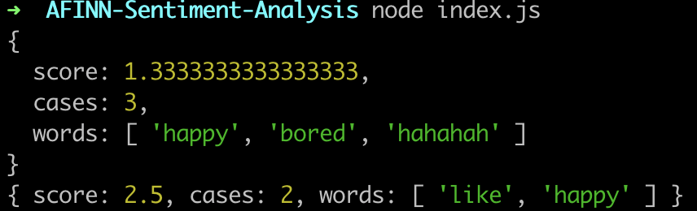

# sentiment-analysis
sentiment analysis algorithm using the AFINN-111 dataset

## Data
dataset can be found here: http://www2.imm.dtu.dk/pubdb/views/publication_details.php?id=6010 (see data/license.txt)

## Documentation

### SentimentAnalysis(path)
```
let analyzer = new SentimentAnalysis('./data/AFINN-111.json')
```
Constructor function <br>
*path* - string, the path to the json file containing the data (by default: ./lib/AFINN-111.json)

### getScore(string)
```
analyzer.getScore('I am happy')
```
This function returns the sentiment score for a particular string  <br>
*string* - string, the input string, for instance a sentence
```
returns:
{
    words: ['word1', ...],
    score: int,
    cases: words.length
}
```

### scoreFile(pathToFile)
```
analyzer.scoreFile('./path/to/file.txt')
```
This function returns the sentiment score of a file   <br>
*pathToFile* - string, path to the input file
```
returns:
{
    words: ['word1', ...],
    score: int,
    cases: words.length
}
```

## Example
Examples can be found in folder examples.

